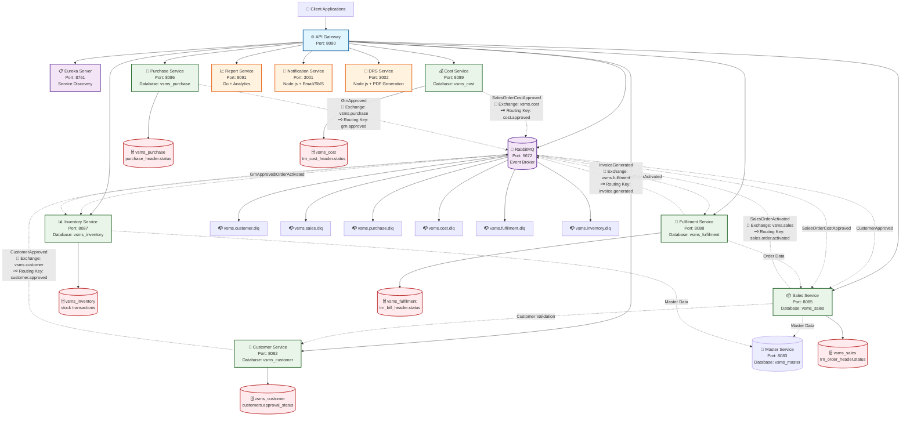
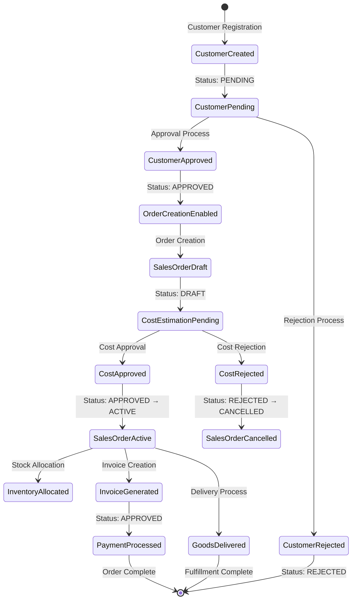

# VSMS Microservices Event Communication Diagram & Status Tracking

## 📋 Executive Summary

This document analyzes the current VSMS microservices event-driven architecture, mapping out the complete communication flow between services and identifying where business process statuses are stored in the database.

## 🏗️ Current Architecture Overview

### Service Communication Pattern
```
API Gateway (8080) → Individual Services → RabbitMQ → Event Consumers
```

### Database per Service Pattern
- Each service owns its domain data
- Events communicate state changes between services
- No direct database coupling between services

---

## 🔄 Event Communication Flow Diagram



---

## 📊 Event Status Tracking Table

| Event | Publisher Service | Consumer Services | Status Field | Possible Values | Database Table |
|-------|------------------|------------------|--------------|-----------------|----------------|
| **CustomerApproved** | Customer Service | Sales Service | `approval_status` | `PENDING`, `APPROVED`, `REJECTED` | `vsms_customer.customers` |
| **SalesOrderActivated** | Sales Service | Inventory Service,<br/>Fulfilment Service | `status` | `DRAFT`, `ACTIVE`, `CANCELLED` | `vsms_sales.trn_order_header` |
| **SalesOrderCostApproved** | Cost Service | Sales Service | `status` | `PENDING`, `APPROVED`, `REJECTED` | `vsms_cost.trn_cost_header` |
| **GrnApproved** | Purchase Service | Inventory Service | `status` | `DRAFT`, `APPROVED` | `vsms_purchase.trn_purchase_header` |
| **InvoiceGenerated** | Fulfilment Service | - | `status` | `DRAFT`, `APPROVED` | `vsms_fulfilment.trn_bill_header` |

---

## 🔍 Detailed Event Analysis

### 1. CustomerApproved Event
**Business Purpose**: Customer approval workflow completion
```java
public record CustomerApproved(
    UUID customerId,
    String customerName,
    String gstNumber,
    // ... other fields
) {}
```

**Status Tracking**:
- **Table**: `vsms_customer.customers`
- **Field**: `approval_status ENUM('PENDING', 'APPROVED', 'REJECTED')`
- **Trigger**: Customer approval/rejection action
- **Impact**: Unlocks order creation for approved customers

### 2. SalesOrderActivated Event
**Business Purpose**: Order lifecycle progression after cost approval
```java
public record SalesOrderActivated(
    String orderCode,
    UUID customerId,
    Long companyId,
    BigDecimal totalAmount,
    LocalDateTime activatedAt
) {}
```

**Status Tracking**:
- **Table**: `vsms_sales.trn_order_header`
- **Field**: `status VARCHAR(20) DEFAULT 'DRAFT'`
- **Trigger**: Cost approval completion
- **Impact**: Enables inventory allocation and invoice generation

### 3. SalesOrderCostApproved Event
**Business Purpose**: Cost estimation approval completion
```java
public record SalesOrderCostApproved(
    String orderCode,
    UUID customerId,
    BigDecimal approvedAmount,
    LocalDateTime approvedAt
) {}
```

**Status Tracking**:
- **Table**: `vsms_cost.trn_cost_header`
- **Field**: `status VARCHAR(20) DEFAULT 'PENDING'`
- **Trigger**: Cost approval workflow completion
- **Impact**: Triggers order activation

### 4. GrnApproved Event
**Business Purpose**: Goods Receipt Note approval for stock intake
```java
public record GrnApproved(
    Long purchaseHeaderId,
    Long itemId,
    Double quantity,
    LocalDateTime approvedAt
) {}
```

**Status Tracking**:
- **Table**: `vsms_purchase.trn_purchase_header`
- **Field**: `status VARCHAR(20) DEFAULT 'DRAFT'`
- **Trigger**: GRN approval action
- **Impact**: Creates stock-in transactions in inventory

### 5. InvoiceGenerated Event
**Business Purpose**: Invoice creation completion
```java
public record InvoiceGenerated(
    Long invoiceId,
    String invoiceNumber,
    String orderCode,
    UUID customerId,
    BigDecimal totalAmount,
    LocalDateTime generatedAt
) {}
```

**Status Tracking**:
- **Table**: `vsms_fulfilment.trn_bill_header`
- **Field**: `status VARCHAR(20) DEFAULT 'DRAFT'`
- **Trigger**: Invoice approval and generation
- **Impact**: Completes order-to-cash cycle

---

## 🔄 Complete Business Process Flow

### Order-to-Cash Cycle Status Tracking



### Status Field Mapping Across Services

| Business Process | Service | Table | Status Field | Values |
|------------------|---------|-------|--------------|---------|
| **Customer Lifecycle** | Customer | `customers` | `approval_status` | `PENDING` → `APPROVED`/`REJECTED` |
| **Sales Order Flow** | Sales | `trn_order_header` | `status` | `DRAFT` → `ACTIVE` → `CANCELLED` |
| **Cost Approval** | Cost | `trn_cost_header` | `status` | `PENDING` → `APPROVED` → `REJECTED` |
| **Purchase Process** | Purchase | `trn_purchase_header` | `status` | `DRAFT` → `APPROVED` |
| **Invoice Process** | Fulfilment | `trn_bill_header` | `status` | `DRAFT` → `APPROVED` |
| **Payment Status** | Fulfilment | `trn_bill_header` | `payment_status` | `PENDING` → `PAID` |

---

## 📋 Service Interaction Matrix

| Publisher → Consumer | Customer Service | Sales Service | Purchase Service | Inventory Service | Cost Service | Fulfilment Service |
|---------------------|------------------|---------------|------------------|-------------------|--------------|-------------------|
| **Customer Service** | - | ✅ CustomerApproved | - | - | - | - |
| **Sales Service** | ✅ (Feign) | - | - | - | - | ✅ (Feign) |
| **Purchase Service** | - | - | - | ✅ GrnApproved | - | - |
| **Inventory Service** | - | - | - | - | - | - |
| **Cost Service** | - | ✅ SalesOrderCostApproved | - | - | - | - |
| **Fulfilment Service** | - | - | - | - | - | - |

**Legend**:
- ✅ **Event Communication** (RabbitMQ)
- ✅ **(Feign)** Direct API calls for data validation
- `-` No direct communication

---

## 🔧 Technical Implementation Details

### RabbitMQ Exchange Configuration
```yaml
# Exchanges defined in docker-compose.yml or service configs
exchanges:
  - name: vsms.customer
    type: topic
  - name: vsms.sales
    type: topic
  - name: vsms.purchase
    type: topic
  - name: vsms.cost
    type: topic
  - name: vsms.fulfilment
    type: topic
  - name: vsms.inventory
    type: topic
```

### Event Publishing Pattern
```java
// Standard event publishing pattern used across services
public interface EventPublisher {
    void publish(String exchange, String routingKey, Object event);
}

// Example implementation
eventPublisher.publish("vsms.customer", "customer.approved",
    new CustomerApproved(customerId, customerName, gstNumber, approvedAt));
```

### Event Consumption Pattern
```java
// Standard event consumption pattern
@RabbitListener(bindings = @QueueBinding(
    exchange = @Exchange("vsms.customer"),
    key = "customer.approved",
    queue = @Queue("customer-approved-queue")
))
public void handleCustomerApproved(CustomerApproved event) {
    // Business logic for customer approval
    updateOrderCreationEligibility(event.customerId());
}
```

---

## 🎯 Key Insights & Recommendations

### Current Architecture Strengths
1. **Event-Driven Decoupling**: Services communicate via events, not direct API calls
2. **Database Isolation**: Each service owns its data, preventing tight coupling
3. **Asynchronous Processing**: Non-blocking event processing improves performance
4. **Business Process Visibility**: Complete audit trail through event logs

### Areas for Enhancement
1. **Event Persistence**: Events should be stored in an event store for replay capabilities
2. **Event Schema Evolution**: Versioning strategy needed for event schema changes
3. **Event Monitoring**: Real-time event processing metrics and alerting
4. **Saga Orchestration**: Distributed transaction management for complex workflows

### Missing Event Consumers
- **InvoiceGenerated**: No current consumers identified in the architecture
- **Potential Consumers**: Accounting systems, external integrations, analytics platforms

### Status Synchronization
- **Cross-Service Status**: Consider event-driven status synchronization
- **Eventual Consistency**: Implement compensation patterns for status conflicts
- **Status Validation**: Add event-driven validation rules between services

---

## 📈 Business Value Delivered

### Operational Benefits
- **Real-time Visibility**: Track order status across the entire business process
- **Automated Workflows**: Event-driven triggers reduce manual intervention
- **System Resilience**: Loose coupling prevents cascade failures
- **Audit Compliance**: Complete transaction history for regulatory requirements

### Technical Benefits
- **Scalability**: Event-driven architecture supports horizontal scaling
- **Maintainability**: Service boundaries reduce complexity
- **Testability**: Isolated services with contract-based event interfaces
- **Monitoring**: Comprehensive observability through event streams

---

## 🔮 Future State Recommendations

### Enhanced Event Architecture
1. **Event Sourcing**: Implement event store for complete system state reconstruction
2. **CQRS Pattern**: Separate read/write models for optimized queries
3. **Event Streaming**: Real-time event processing with Apache Kafka
4. **Saga Orchestration**: Distributed transaction management across services

### Advanced Analytics
1. **Event-driven Dashboards**: Real-time business metrics
2. **Predictive Analytics**: ML models trained on event patterns
3. **Business Intelligence**: Cross-service reporting and insights

This comprehensive event communication analysis provides a solid foundation for understanding the current VSMS architecture and planning future enhancements toward a more robust, event-driven enterprise system.